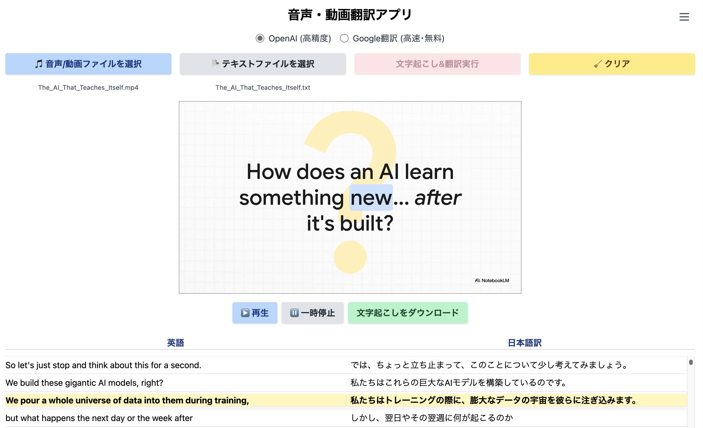

# 音声・動画翻訳アプリ
<div align="center" style="margin: 30px 0;">
    
</div>
このアプリは．**英語音声ファイル・動画ファイルのアップロード・自動文字起こし・日本語翻訳**を行い， 再生と同時に英語・日本語の対応テキストをハイライト表示できるWebアプリです．

## 主な機能

- 英語音声ファイル・動画ファイルのアップロードと自動文字起こし（OpenAI Whisper利用）
- 英文テキストの日本語翻訳
- 音声・動画再生に合わせた英語・日本語テキストの同期ハイライト表示
- 文字起こし・翻訳結果のTSV形式ダウンロード／アップロード

## セットアップ

### 1. 必要な環境変数の設定

プロジェクトルート直下に`env.sample`を参考に`.env.local`ファイルを作成し，以下のようにOpenAI APIキー，エンドポイント，利用モデルを記載してください．

```
NEXT_PUBLIC_OPENAI_API_KEY=sk-
NEXT_PUBLIC_ENDPOINT=https://api.openai.com
NEXT_PUBLIC_MODEL_NAME=gpt-4.1-mini
```

> ※ Google翻訳エンジンはAPIキー不要です．

## 実行方法

### 方法1: Docker Composeを使用（推奨）

```bash
docker compose up --build
```

- `.env.local`の内容はDockerコンテナにも自動で反映されます．
- アプリへのアクセス: [http://localhost:13001](http://localhost:13001)

### 方法2: ローカルでnpmを使用

```bash
npm install
npm run dev
```

- アプリへのアクセス: [http://localhost:3000](http://localhost:3000)

---

## 使い方

### 1. 文字起こし機能

**対応ファイル**: 音声ファイルのみ

1. **音声ファイル**をアップロード
2. 「文字起こし&翻訳実行」ボタンをクリック
3. タイトル下のラジオボタンで翻訳エンジン（OpenAI/Google）を選択可能
4. 文字起こし・翻訳が実行され，結果が表示されます
5. 結果をTSV形式でダウンロード可能

### 2. 再生機能

**対応ファイル**: 音声ファイル・動画ファイル

1. **音声ファイル**または**動画ファイル**をアップロード
2. **TSVファイル**（文字起こし機能で作成したもの）をアップロード
3. 音声・動画の再生に合わせて，英語・日本語テキストが同期ハイライト表示されます
4. 再生速度の調整や一時停止・再開が可能

### OpenAI設定について

右上のメニュー（☰）から以下の設定が可能です：
- OpenAI APIキーの設定
- OpenAI APIエンドポイントの設定
- 利用モデルの選択
